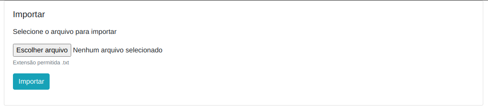
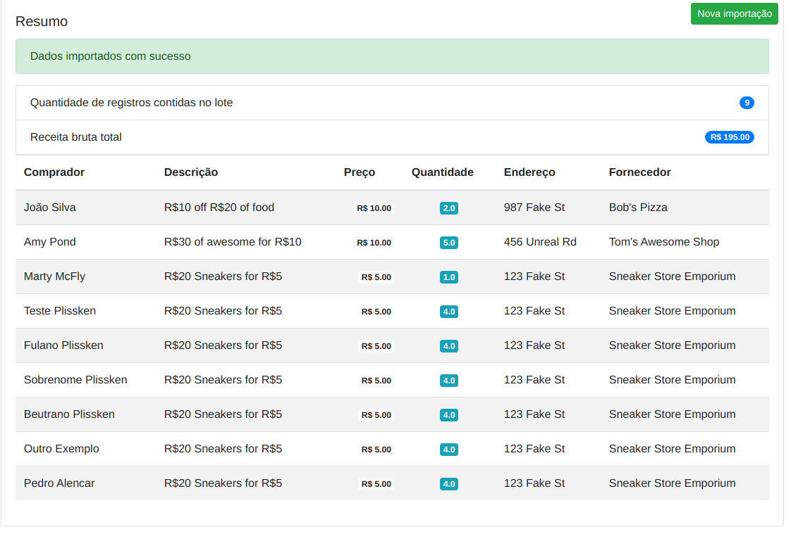

# Ferramenta de importação .txt

Raliza importação de arquivo de texto (.txt) separados por TAB (\t)


> Tela do formulário de importação do arquivo


> Tela de resumo dos arquivos importados


## Requisitos

* Ruby 2.2+
* Rails 5.x
* SQLite

## Instalação

1 - Efetue o clone do projeto
```
git clone https://github.com/Yonatha/import.git
```

2 - Acesse o diretório clonado
```
cd import
```

3 - Execute a task de instalação do sistema
```
rake db:setup
```

4 - Execute o servidor da aplicação

```
rails s
```

5 - Acesse

```
http://localhost:3000
```

## Teste

Antes de executar o teste certifique-se de rodar os migrations no environment de test   
```
rails db:migrate RAILS_ENV=test
```

Execute os testes com o comando:
```
rake
```

## TODO
* Finalizar os testes da importação
* Fazer testes do model
* Implementar a mecânica de detecção de linhas inválidas e gerar um arquivo de saída contendo os registros que não podem ser importados, afim de que sejam corrigidos e reimportados na ferramenta
* Adicionar o sidekiq para realizar o processamento em um worker 
* Criar o docker-compose para facilitar a execução do projeto sem a necessidade do usuário ter as versões do ruby e rails instaladas no hospedeiro, mas com uma resalva do requisito de ter apenas o docker instalado
* Adicionar busca na view do lote de registros improtado